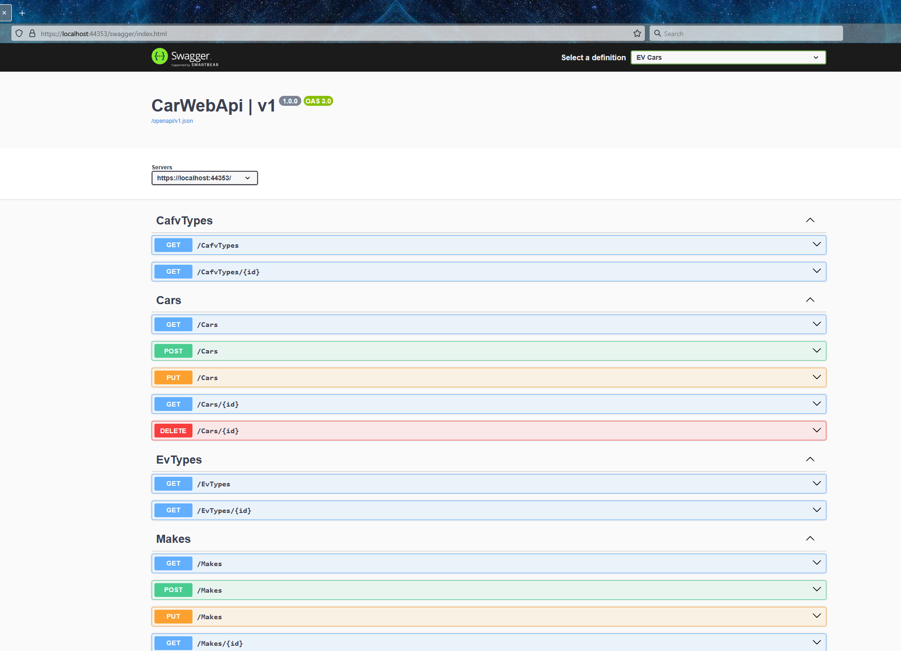

# Download data
	Download the latest Electric Vehicle Population Data (https://catalog.data.gov/dataset/electric-vehicle-population-data) dataset from data.gov in any format, CSV is downloaded from https://data.wa.gov/api/views/f6w7-q2d2/rows.csv?accessType=DOWNLOAD

See `Database/data.json`

# Create Schema
	Create a schema for this data using PostgreSQL

See `Database/evs_schema.sql`

# Create data inserts
	Create appropriate data inserts using PostgreSQL

Though this was better handled with the "Loader" project, an abbreviated set of examples can be found in `insert_makes_data.sql`, `insert_models_data.sql` and `insert_cars_data.sql` all in the `Database` directory. Take care to run them in that order.

# Create REST API
	Create a REST API to expose CRUD operations for the database using any language (Java Preferred)

This is provided via the CarWebApi project, details can be found in `How To Run.md`

# Create Tests 
	Provide appropriate testing for you application

There are both functional and unit tests, where applicable. Running is obvious, but additional details can be found in `How To Run.md`

# Create Documentation 
	Provide appropriate documentation on running your application

This is dynamically generated via swagger. Wherever you host the service, add /swagger to the base url. You should expect to see a page both describing the interface and allowing interactivity:

 

# Create client (for the) API
	Create a client for the API in any language, can be command line

This is provided as a class library, CarWebApiClientLibrary. Separate documentation is found in `CarWebApiClientLibrary.md`.

# Document how to change data
	Document how you would go about changing the Base MSRP for all Tesla Model Y vehicles and the assumptions made.

This was somewhat vague, a somewhat vague answer is provided in `HowToUpdateTesla.md`

# Helm

Helm scripts are located in the /Helm subdirectory
